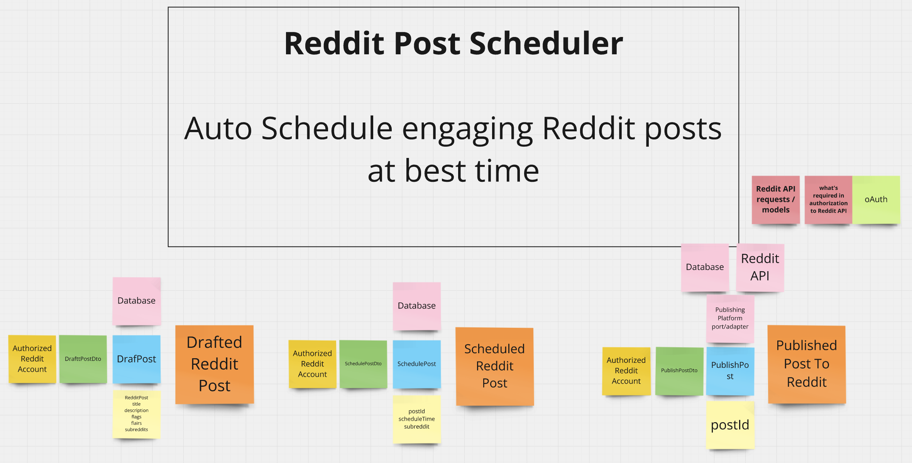
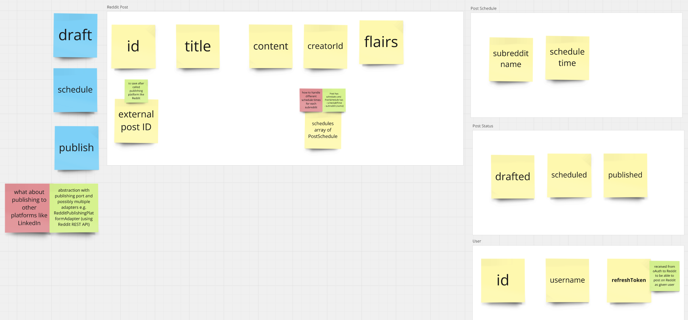
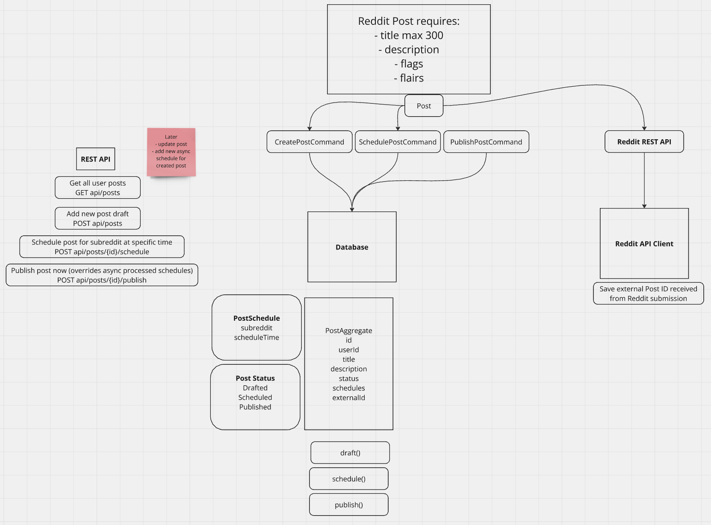

## ScheduleMyPost backend

It's an MVP for [ScheduleMyPost](https://schedulemypost.com/) backend. A REST API built with NestJS, following best practices including CQRS, basic DDD, and software testing with Jest/Supertest.

- 80%+ tests coverage with Jest, Supertest, and @nestjs/testing to cover unit, integration, and e2e cases
- basic DDD to organize app in contexts, layers and align with the business domain
- CQRS to separate read and write operations

### Notes

### Event Storming in Miro to map the idea



### Basic schema mapping



### Technical architecture diagram



## Installation

```bash
$ git clone https://github.com/piotrprzybytniewski/schedule-my-post-api.git
$ npm install
```

## Running the app

```bash
# development
$ npm run start

# watch mode
$ npm run start:dev

# production mode
$ npm run start:prod
```

## Running the tests

```bash
# unit tests
$ npm run test

# e2e tests
$ npm run test:e2e

# test coverage
$ npm run test:cov
```

## License

ScheduleMyPost is [MIT licensed](https://github.com/piotrprzybytniewski/schedule-my-post-api/main/LICENSE).
